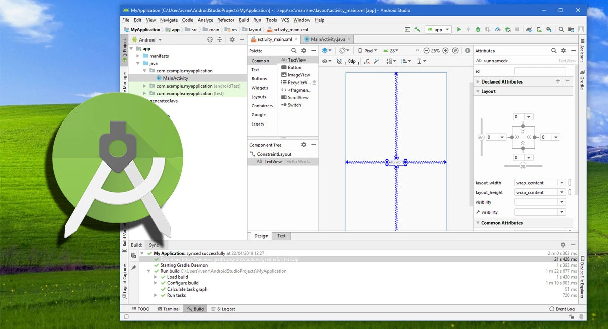

# 2025-1 Programación Movil - Quiz

Este aplicativo móvil es una plataforma interactiva dedicada a los aficionados del deporte, principalmente del fútbol, donde los usuarios podrán poner a prueba sus conocimientos sobre diversas disciplinas deportivas. El sistema se basa en una serie de preguntas de opción múltiple sobre temas como historia, jugadores, equipos, competiciones y estadísticas. Los usuarios podrán competir de manera individual <b>o en tiempo real con otros jugadores</b>, comparando sus resultados y obteniendo puntos por cada respuesta correcta.

Además, la aplicación contará con diferentes niveles de dificultad, desde preguntas más fáciles hasta desafíos complejos para expertos. Los usuarios podrán seguir su progreso a lo largo del tiempo, acceder a estadísticas personalizadas. Con una interfaz amigable y actualizaciones constantes con nuevos contenidos, el aplicativo promete ser una herramienta divertida y educativa para todos los apasionados del fútbol y otros deportes.

- [Configuración del Ambiente de Desarrollo](#configuración-del-ambiente-de-desarrollo)
- [Diagrama de Despliegue](#diagrama-de-despliegue)
- [Requerimientos No Funcionales](#requerimientos-no-funcionales)

## Configuración del Ambiente de Desarrollo

Paso a paso que usaremos en el proyecto.

*<b>Figura 1:</b> Instalación de Android Studio*

## Diagrama de Despliegue

La arquitectura a usar será una aplicación web y una aplicación móvil. La aplicación móvil accede a la aplicación web a través de Internet, mientras que la aplicación web consulta y almacena datos en la base de datos. Este modelo de la Figura 2 ilustra cómo los clientes interactúan con la aplicación y cómo se gestionan los datos en el servidor.

*<b>Figura 2:</b> Diagrama de despliegue*

## Requerimientos No Funcionales

A continuación, se presentan los requerimientos no funcionales para la arquitectura descrita en el diagrama, considerando el uso de **Flutter** para la aplicación móvil.

### 1. Escalabilidad  
El servidor web debe ser capaz de manejar múltiples solicitudes simultáneamente sin afectar el rendimiento.

### 2. Disponibilidad  
La aplicación debe estar disponible al menos el **99.9%** del tiempo para garantizar el acceso continuo de los clientes.

### 3. Seguridad  
La comunicación entre la aplicación móvil y la aplicación web debe estar protegida mediante **HTTPS** y autenticación segura (**OAuth 2.0, JWT**).

### 4. Compatibilidad  
La aplicación móvil desarrollada en **Flutter** debe ser compatible con **Android** e **iOS** sin pérdida de funcionalidad.

### 5. Rendimiento  
La respuesta del servidor a las solicitudes del cliente no debe exceder los **200 ms** en condiciones normales de uso.

### 6. Mantenimiento  
El sistema debe permitir actualizaciones sin interrumpir el servicio mediante despliegues continuos (**CI/CD**).

### 7. Usabilidad  
La interfaz de la aplicación móvil debe seguir las directrices de **Material Design** para una experiencia intuitiva.

### 8. Integridad de Datos  
La base de datos debe garantizar la consistencia de los datos mediante mecanismos de transacción **ACID**.

### 9. Registro y Monitoreo  
El servidor web debe contar con un sistema de **logging y monitoreo en tiempo real** para detectar fallos.

### 10. Optimización de Red  
La comunicación entre el cliente y el servidor debe minimizar el uso de datos mediante **compresión y caching de respuestas**.

## Diagrama de Casos de Uso

El siguiente diagrama de casos de uso representa las principales interacciones dentro del Sistema de Quizzes, basado en el modelo de clases previamente definido. En este sistema, los usuarios pueden registrarse, iniciar sesión, crear y responder quizzes, así como consultar su historial de intentos. Por otro lado, los administradores tienen permisos adicionales para gestionar preguntas, temas y administrar cuentas de usuario. Estas funcionalidades garantizan una experiencia dinámica y organizada para la creación y resolución de quizzes dentro de la plataforma móvil.

A continuación se detallan los casos de uso:

| ID   | Caso de Uso                 | Descripción |
|------|-----------------------------|-------------|
| UC1  | Registrarse                 | Permite crear una cuenta en el sistema proporcionando los datos personales. |
| UC2  | Iniciar sesión              | Permite autenticarse en el sistema ingresando el nombre de usuario y contraseña. |
| UC3  | Crear Quiz                  | Permite diseñar y crear quizzes, agregando preguntas y respuestas. |
| UC4  | Responder Quiz              | Permite seleccionar y responder quizzes disponibles en el sistema. |
| UC5  | Ver historial de Quizzes    | Permite consultar los quizzes realizados y visualizar sus resultados. |
| UC6  | Gestionar Preguntas         | Permite agregar, editar o eliminar preguntas dentro del sistema. |

Y el diagrama de clases es el siguiente:

## Prototipos

En función a los casos de uso se proponen los siguientes prototipos:

Caso de Uso: Nombre de CU

